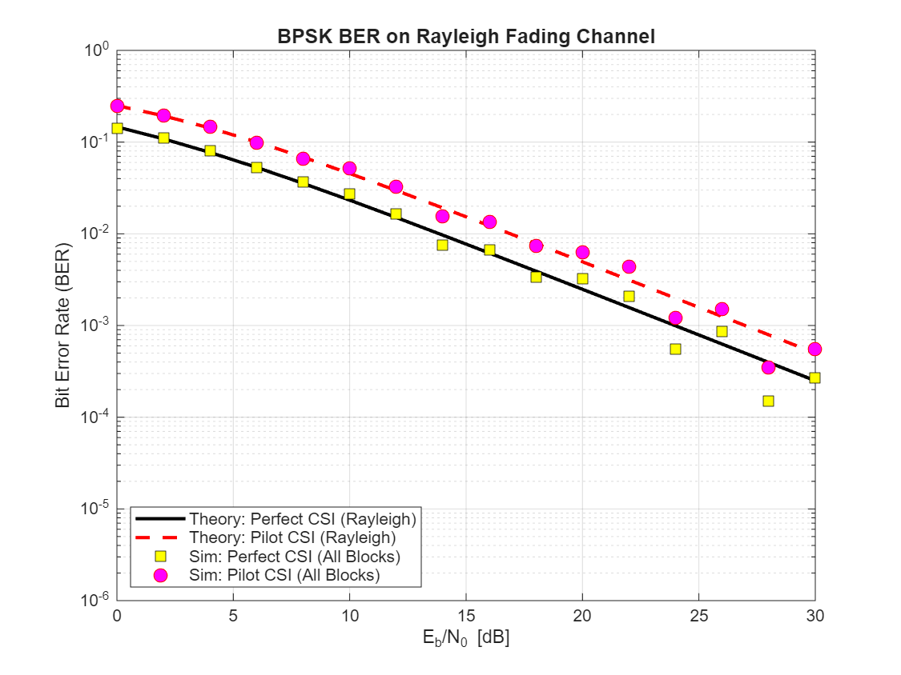
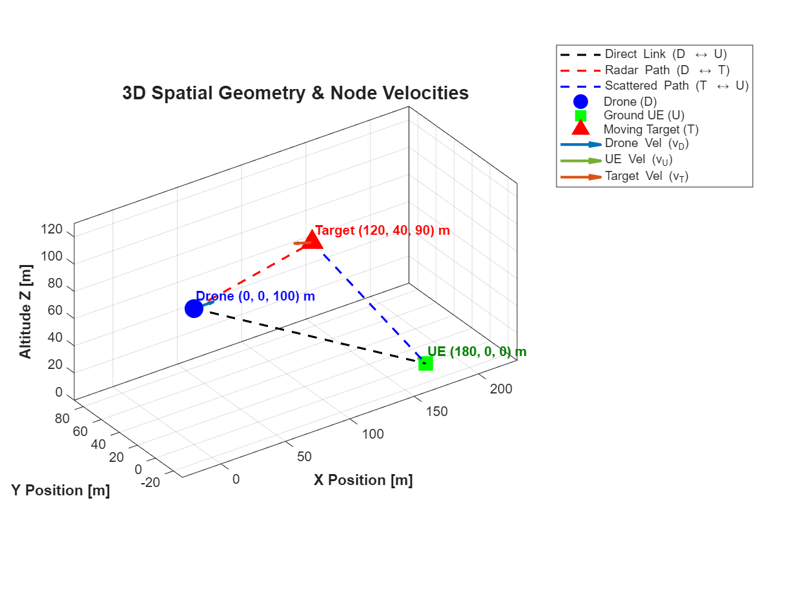
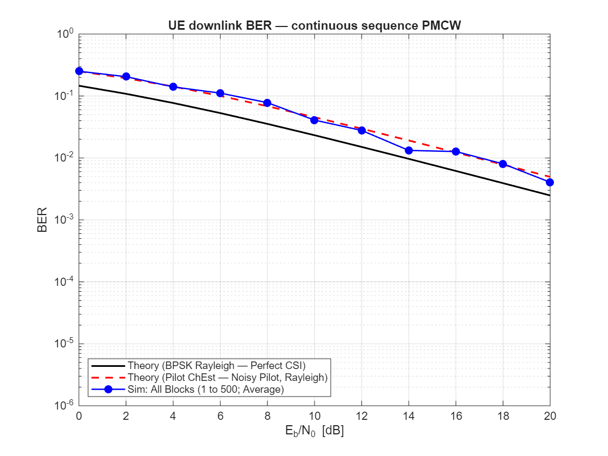

# Adding CP to avoid the inter-block-interference

## Results for point-to-point simulation with CP

## Results for 3-node simulation with CP

### Geometry

### BER

Note: the Theory lines are the lines analysed with 2-node system; the Sim line is with 3-node system. Because the scattering is small, it still matches with the Theory line.

### Range-Doppler heatmap

- Growing window (FFT window for Doppler observation)

- Sliding window (FFT window for Doppler observation)

