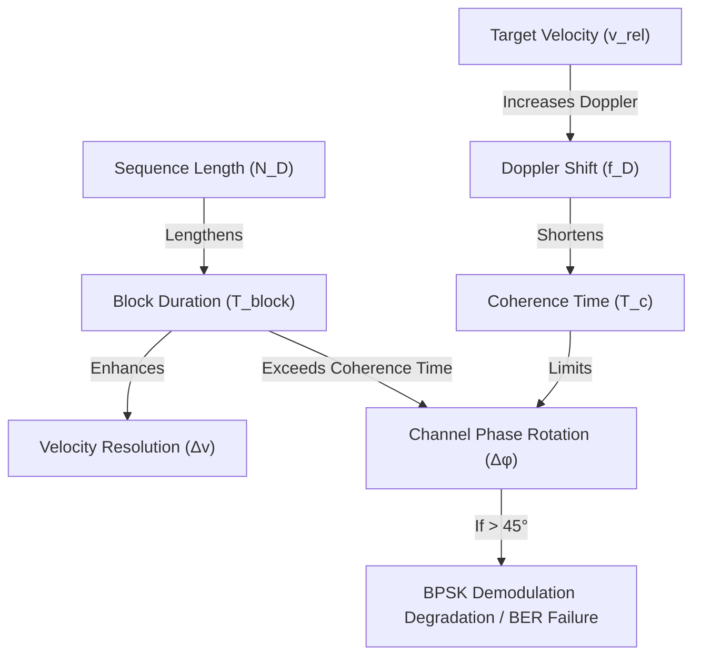

# Coherence Time, Sensing Resolution, and Parameter Entanglement in NTN-ISAC

This document analyzes the mathematical and physical trade-offs in a Phase-Modulated Continuous Wave (PMCW) Non-Terrestrial Network Integrated Sensing and Communications (NTN-ISAC) system. It examines how relative velocities, channel coherence time, sequence length, and sensing resolution are interconnected ("entangled") and evaluates whether the current system settings satisfy these constraints.

---

## 1. The Waveform and Frame Structure

In this PMCW system, the transmitted signal is organized into slow-time blocks of duration $T_{\text{block}}$. Each block is divided into two equal periods of length $T_{\text{PRI}}$:
*   **Sounding Period (Preamble):** Transmits an unmodulated Maximum-Length Sequence (MLS) of length $N_D$ chips (duration $T_{\text{PRI}} = N_D T_c$) to perform channel estimation.
*   **Communication Period (Data):** Transmits the MLS modulated by a BPSK data symbol $d_m \in \{+1, -1\}$ (duration $T_{\text{comm}} = N_D T_c$).

Thus, the total block duration is:
$$T_{\text{block}} = T_{\text{PRI}} + T_{\text{comm}} = 2 N_D T_c = \frac{2 N_D}{B}$$
where $B$ is the signal bandwidth (chip rate) and $T_c = 1/B$ is the chip duration.

---

## 2. The Entanglement of Physical Parameters

The system design is governed by three conflicting requirements:

### A. Doppler Shift and Coherence Time
The relative movement between the Drone and the UE introduces a one-way Doppler shift on the direct communication link:
$$f_{D,DU} = -\frac{v_{r,DU}}{\lambda_D}$$
where $v_{r,DU}$ is the radial relative velocity and $\lambda_D = c_0 / f_{c,D}$ is the carrier wavelength.

The channel **coherence time** $T_c$ is the time interval over which the channel can be considered invariant. Using the standard definition (e.g., Clarke's model for 50% correlation):
$$T_c \approx \frac{0.423}{f_{D,DU}}$$

### B. Sounding Channel Validity for Communication
The channel estimate $\hat{h}_{DU}[m]$ is acquired during the sounding period and is used to equalize the data symbol during the communication period.
The maximum time delay between the sounding estimation and the end of the communication period is $T_{\text{block}}$. 

During this interval, the channel phase rotates by:
$$\Delta \phi = 2 \pi f_{D,DU} T_{\text{block}}$$

For BPSK demodulation to succeed without severe SNR degradation:
1.  **Strict Constraint (Low Loss):** $\Delta \phi \ll 45^\circ$ ($0.785\text{ rad}$). A $45^\circ$ phase error results in a $3\text{ dB}$ SNR loss because the decision statistic scales as $\cos(\Delta \phi)$.
2.  **Failure Threshold:** $\Delta \phi \ge 90^\circ$ ($1.57\text{ rad}$). If the phase rotates by more than $90^\circ$, the BPSK decision boundary is crossed, causing a 100% error rate in the absence of noise (BER $\approx 0.5$).

Therefore, the communication constraint dictates:
$$T_{\text{block}} \le \frac{\Delta \phi_{\text{max}}}{2\pi f_{D,DU}} \implies N_D \le \frac{B \cdot \Delta \phi_{\text{max}}}{4\pi f_{D,DU}}$$

### C. Sensing Resolution
For radar sensing, the drone integrates over $M$ blocks. The total coherent processing interval is $T_{\text{CPI}} = M T_{\text{block}}$.
The resulting **velocity resolution** $\Delta v$ is:
$$\Delta v = \frac{\lambda_D}{2 T_{\text{CPI}}} = \frac{\lambda_D}{2 M T_{\text{block}}} = \frac{\lambda_D B}{4 M N_D}$$

To obtain a fine (small) velocity resolution $\Delta v$, we must **increase** $T_{\text{block}}$ (by increasing the sequence length $N_D$) or increase $M$. 

---

## 3. Analysis of Current Settings

Let's evaluate the system parameters configured in `long_sequence_sync`:

### System Parameters
*   **Carrier Frequency ($f_{cD}$):** $24\text{ GHz} \implies \lambda_D = 0.0125\text{ m}$ (K-band)
*   **Bandwidth ($B$):** $50\text{ MHz} \implies T_c = 20\text{ ns}$
*   **Slow-time Blocks ($M$):** $256$

### Geometry and Velocities
*   **Drone Velocity ($\mathbf{v}_D$):** $[15, 0, 0]\text{ m/s}$ (54 km/h)
*   **UE Velocity ($\mathbf{v}_U$):** $[0, 8, 0]\text{ m/s}$ (28.8 km/h)
*   **Relative Velocity Vector ($\mathbf{v}_U - \mathbf{v}_D$):** $[-15, 8, 0]\text{ m/s} \implies \|\mathbf{v}_{\text{rel}}\| = 17\text{ m/s}$
*   **Unit LOS Vector ($\mathbf{u}_{DU}$):** $[0.874, 0, -0.486]$
*   **Radial Velocity ($v_{r,DU}$):** $-13.11\text{ m/s}$
*   **Direct Link Doppler ($f_{D,DU}$):** $-(-13.11) / 0.0125 \approx \mathbf{1049\text{ Hz}}$

### Coherence Time
$$T_c \approx \frac{0.423}{1049} \approx \mathbf{403\text{ }\mu\text{s}}$$

---

## 4. Evaluation of Sequence Lengths ($N_D$)

We analyze the performance of four different sequence lengths under these parameters:

| Sequence Length ($N_D$) | Block Duration ($T_{\text{block}}$) | Coherent Processing ($T_{\text{CPI}}$) | Velocity Resolution ($\Delta v$) | Phase Rotation ($\Delta \phi$) | Communication Status |
| :--- | :--- | :--- | :--- | :--- | :--- |
| **127** (Default, $m=7$) | $5.08\text{ }\mu\text{s}$ | $1.30\text{ ms}$ | $4.81\text{ m/s}$ | $1.92^\circ$ | **Excellent** (Practically static) |
| **255** ($m=8$) | $10.20\text{ }\mu\text{s}$ | $2.61\text{ ms}$ | $2.39\text{ m/s}$ | $3.86^\circ$ | **Excellent** (Negligible loss) |
| **1023** ($m=10$) | $40.92\text{ }\mu\text{s}$ | $10.48\text{ ms}$ | $0.60\text{ m/s}$ | $15.51^\circ$ | **Satisfactory** (~0.16 dB SNR loss) |
| **1512** (Long Sequence) | $60.48\text{ }\mu\text{s}$ | $15.48\text{ ms}$ | $0.40\text{ m/s}$ | $22.92^\circ$ | **Marginal** (~0.35 dB SNR loss) |

### Findings:
1.  **$N_D = 127$:** The channel is highly coherent during the block ($1.92^\circ$ phase drift), so communication is extremely reliable. However, the sensing velocity resolution is very poor ($\Delta v = 4.81\text{ m/s}$ or $17.3\text{ km/h}$).
2.  **$N_D = 1023$ and $1512$:** These sequences provide highly desirable velocity resolutions ($0.60\text{ m/s}$ and $0.40\text{ m/s}$), which are necessary to separate targets (like drones from birds). Under the current relative velocity ($17\text{ m/s}$), the phase drift ($15.51^\circ$ and $22.92^\circ$) is still low enough to allow communication, though it begins to introduce small SNR losses.

---

## 5. What Happens at Higher Velocities?

In real-world NTN-ISAC scenarios, relative velocities can easily be much higher (e.g., if the drone is flying at $30\text{ m/s}$ and the UE is in a vehicle moving at $20\text{ m/s}$ in the opposite direction, $v_{\text{rel}} \approx 50\text{ m/s}$).

Let's calculate the phase drift at $v_{\text{rel}} = 50\text{ m/s} \implies f_{D,DU} = 4000\text{ Hz}$ ($T_c \approx 106\text{ }\mu\text{s}$):
*   **For $N_D = 127$:** $\Delta \phi = 2\pi \times 4000 \times 5.08\times 10^{-6} \approx 7.3^\circ$ (Still safe).
*   **For $N_D = 1023$:** $\Delta \phi = 2\pi \times 4000 \times 40.92\times 10^{-6} \approx \mathbf{59.0^\circ}$ (Severe degradation, $>1.2\text{ dB}$ SNR loss, high BER).
*   **For $N_D = 1512$:** $\Delta \phi = 2\pi \times 4000 \times 60.48\times 10^{-6} \approx \mathbf{87.1^\circ}$ (DEMODULATION FAILURE: near the $90^\circ$ limit, the channel estimate from sounding is completely invalid for the communication symbols).

---

## 6. The Need for Channel Prediction

The trade-off creates a fundamental bottleneck:
*   **Short sequences** preserve communication reliability at high speeds but render the radar sensing blind to fine velocity differences.
*   **Long sequences** achieve excellent radar velocity resolution but cause communication links to fail due to Doppler-induced phase drift.

To break this bottleneck, **Channel Prediction** (or **Doppler-compensated equalization**) must be introduced in the receiver:

Instead of using the static channel estimate $\hat{h}_{DU}[m]$ directly:
$$z_{\text{eq}}[m] = \frac{z_{\text{mf}}[m]}{\hat{h}_{DU}[m]}$$

The receiver should estimate the Doppler frequency $\hat{f}_{D,DU}$ (which can be derived from block-to-block channel estimation changes) and project (predict) the channel state forward in time to the communication period:
$$\hat{h}_{DU}(t_{\text{data}}) = \hat{h}_{DU}[m] \cdot e^{j 2 \pi \hat{f}_{D,DU} T_{\text{PRI}}}$$

Applying this predicted channel for equalization cancels the phase drift $\Delta \phi$, restoring BPSK demodulation performance and allowing the system to use long sequences (like 1024 or 1512) for high-performance radar sensing.
